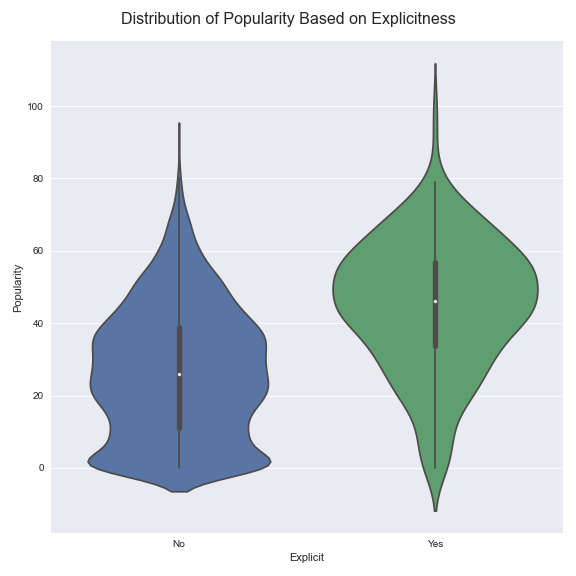
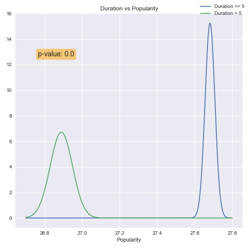
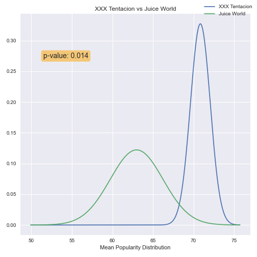

# Spotify Tracks 1922-2020

CHECK OUT MY **[SLIDESHOW PRESENTATION ON MY DATA](https://docs.google.com/presentation/d/1cttccW1RLlrmLTyCdcZ3ZJ5WHiBDWvAYIgO6gkWdqj4/edit?usp=sharing)** 

NOTE: The data folder is not in this repo due to GitHub's size limit, **[here](https://www.kaggle.com/yamaerenay/spotify-dataset-19212020-160k-tracks)** is where you can find the tracks.csv file needed for this project to run.

NOTE: The Spotify API auth key is also missing for security purposes. In order to get your own Spotify API key follow **[these instructions](https://developer.spotify.com/documentation/web-api/quick-start/)**

---
## EDA

### A Look at the Data ~ 600k Tracks

* ID ◼
* Name ◼
* Popularity ★
* Explicit ♦
* Artists (◼,◼)
* Release Date ◼
* Danceability ♣
* Energy ♣
* Key  ★
* Loudness ♣
* Speechiness ♣
* Acousticness ♣
* Instrumentalness ♣
* Liveness ♣
* Valence ♣
* Mode	 ★
* Tempo ♣
* Time Signature  ★
* Duration ♣
* Release Year ★

###### ◼ string, ★ int, ♦ boolean, ♣ float,  

### Key Metrics Used
* Name ◼
* Popularity ★
* Danceability ♣
* Duration ♣
* Release Year ★

### Visualizing the Data


Note: The boxplots exclude outliers


---

## Hypothesis Testing

### What Changes The Popularity?

* Explicit
* Duration

### Popularity vs Explicitness



* H0: Explicit = Non Explicit

* HA: Explicit > Non Explicit

* Using a bootstrapping technique we can simulate grabbing multiple means of sample data sets from our sample


* 95% Confidence Intervals
  * Non Explicit: (26.72, 26.74)

  * Explicit: (45.68, 45.69)

* Since my confidence intervals never overlap, I will __reject the null hypothesis__. There is enough evidence to show the __mean population popularity between explicit songs and non-explicit songs is greater in the explicit songs__.

### Popularity vs Duration

* H0: Popularity of songs with length less than or equal to 5 minutes __is equal to the__  Popularity of songs with length greater than 5 minutes

* HA: Popularity of songs with length less than or equal to 5 minutes __is greater than the__  Popularity of songs with length greater than 5 minutes

* Using the __Central Limit Theorem__ I will make a normal model and using __Welch's T-Test__ I will calculate my __P-value__.


* At an __α level of 0.05__ and with a __P-value of 1.57e-34__ I will __Reject the Null Hypothesis__. There is enough evidence to show that the __population popularity mean for songs less than or equal to 5 min in length is greater than that of songs greater than 5 min in length__.




## Spotfiy API

### Using The Spotify API to Compare Artists

I was able to create a couple helper functions that would simplify the process of comparing two different artists using the Spotify API and a given metric. Through that, we can go ahead an make faster hypothesis tests.

Using the __Central Limit Theorem__ we can conduct __Welch's T-Test__ on the wanted metric and from there receive a __P-Value__

We can assume our __Null and Alternative Hypothesis__ go as follows:
  * H<sub>0</sub>: ArtistOne<sub>Metric</sub> = ArtistTwo<sub>Metric</sub>

  * H<sub>A</sub>: ArtistOne<sub>Metric</sub> > ArtistTwo<sub>Metric</sub>

Below you'll find the __doc strings__ for the functions that make this process simply for you to use.

```
def GetTwoArtists(artist_one, artist_two, years=None, nofeatures=True, metric='popularity', save=False, nameAppend=""):
    """Get the test for two different artists according to a metric.

    NOTE: CompareArtistsCLT() is called from within this function

    Parameters
    ----------
    artist_one : list<track>
        a list of analysis track objects
    artist_two : list<track>
        a list of analysis track objects
    years : string
        years to look for in spotify data
    nofeatures : boolean
        do we want data with features
    metric : string
        the metric to look for
    save : boolean
        save figure?
    nameAppend : string
        text to append to filename
    Returns
    -------
    artist_one
        artist_one track analysis
    artist_two
        artist_two track analysis
    """

def CompareArtistsCLT(self, artists, metric='popularity', labels=[], save=False, nameAppend=""):
      """Compare artists metrics using central limit theorem and t testing

      Parameters
      ----------
      artists : list<track data>
          artists data to use
      metric : string
          metric to measure
      labels : list<string>
          list of strings to label our normal models
      save : boolean
          save figure?
      nameAppend : string
          text to append to data

      Returns
      -------
      float
          p value  of our t test
      """
```

Below you'll find some sample tests I've conducted as well as their result

### XXX Tentacion vs Juice World (Popularity)



##### __Reject Null Hypothesis__

### Kanye West vs J Cole (Popularity)


##### __Fail to Reject Null Hypothesis__

### Bad Bunny vs J Balvin (Danceability)


##### __Fail to Reject Null Hypothesis__

---
